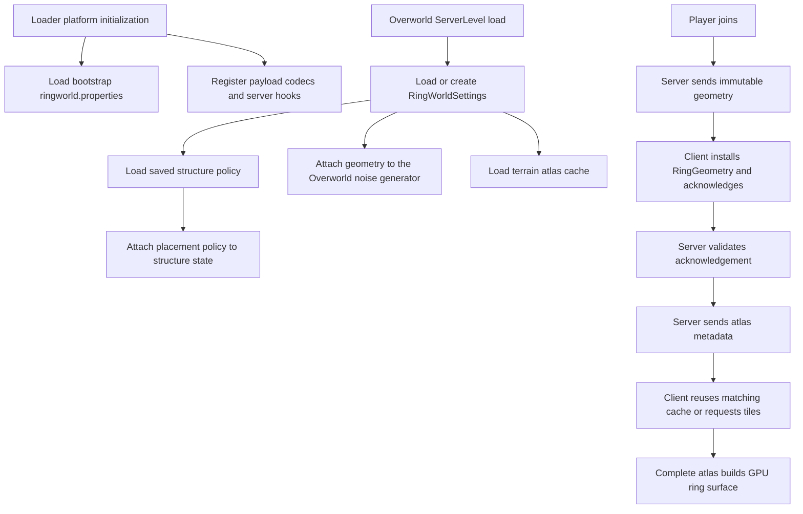
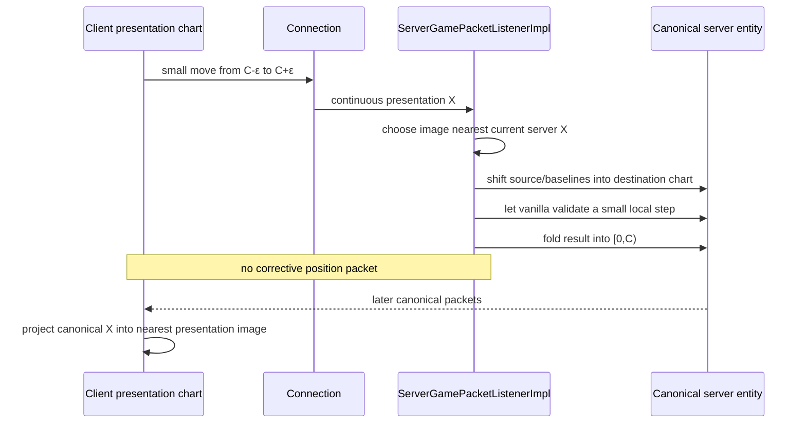

# Architecture

## Scope

RingWorld replaces the Overworld's horizontal topology with a finite cylinder:

- X is a periodic circumference;
- Z is a finite band width;
- Y is ordinary Minecraft height;
- real simulation uses intrinsic Minecraft coordinates;
- the client embeds those coordinates into a cylinder for display.

The mod does not put entities into literal Cartesian coordinates around a star.
That choice preserves vanilla movement and gravity while still producing a
curved visual world.

The implementation spans five coupled layers:

| Layer | Responsibility |
| --- | --- |
| Geometry/topology | Pure wrapping, shortest distances, presentation images, and cylindrical transforms |
| Worldgen/storage | Periodic noise, canonical chunks, finite width, void exterior, and rims |
| Server simulation | Canonical entity storage, tracking, queries, interaction, ticks, and movement validation |
| Network/client charts | Required settings handshake and canonical-to-nearest-image packet mapping |
| Rendering | Curved chunks/entities/clouds, fixed sky, complete-ring LOD texture, and culling |

## Loader boundary

Fabric has the validated client/runtime implementation, and NeoForge has a
dedicated-server bootstrap plus complete graphical-client parity checkpoint.
The architecture targets a
loader-neutral core with thin Fabric and NeoForge adapters. Geometry,
topology, persistent settings, atlas formats, atlas-pregeneration model and
cursor, coordinate transforms, protocol models, renderer math, mixin behavior
that is valid on both loaders, and their tests belong to shared code.

Platform-owned code is limited to:

- mod metadata and entrypoints;
- lifecycle, command, connection, tick, chunk, and render event registration;
- custom-payload registration, sending, and handler scheduling;
- game/configuration directory discovery;
- loader dependency declarations, packaging, and launch fixtures.

The active source boundary makes this enforceable: shared code lives under
`src/main/java` and `src/client/java`. `verifyLoaderBoundary` rejects either
loader API namespace in those shared trees. Fabric adapters live in
`src/platform/fabric` and
`src/platform/fabricClient`; NeoForge adapters live in `src/platform/neoforge`
and `src/platform/neoforgeClient` and are built by the `neoforge` ModDevGradle
module. NeoForge receives parallel platform trees rather than copies of shared
domain behavior.

New features should depend on small RingWorld-owned platform interfaces rather
than importing a loader API into shared domain code. Both adapters must
preserve the same saved-data and network formats. The shared client
`RingClientPayloadTransport` and `RingWorldClientSession` keep payload
sends/capability checks and teardown loader-neutral; each loader supplies its
own narrow transport and lifecycle registration. NeoForge also registers the
shared ring-surface render pipeline in its client event and packages the shared
client mixins and resources. Its 26.1.2.87 client has loaded those resources,
acknowledged format 2, and passed a complete-atlas tangent/handoff/radial
projection gate in a copied production integrated world. The seam/rim,
time/weather, lifecycle, worldgen/structure, headless-atlas, and dedicated
two-client gameplay gates also pass. Local Fabric and NeoForge package parity
is complete; distributed artifacts remain Fabric-only until final candidate
review and owner-approved NeoForge publication.

## The three coordinate domains

Most difficult bugs in this project are caused by using a valid coordinate in
the wrong domain.

### 1. Canonical intrinsic coordinates

This is the authoritative server and save space.

For circumference `C` and width `W`:

```text
0 <= X < C
minZ = -W / 2
maxZ = minZ + W - 1
```

Y is vanilla height. Blocks, canonical chunks, scheduled ticks, persistent
entities, and server watch state use this domain.

`RingGeometry.wrapX`, `wrapBlockX`, and `RingChunkCoordinates.wrapChunkX`
perform the conversion. `RingTopology` supplies higher-level operations.

### 2. Client presentation coordinates

The client keeps the nearest periodic image around its current view. For a
2048-block circumference, canonical X=2 might be displayed at X=2050 after a
positive seam crossing.

```text
presentationX = canonicalX + chartIndex * C
```

`RingPosition` records `(canonicalX, chartIndex)`. `ClientRingState` advances
the chart by selecting the canonical image nearest the previous presentation
position. The chart:

- keeps camera motion continuous;
- lets chunks and entities immediately beyond the seam occupy nearby values;
- is not saved;
- is not sent as chunk ownership;
- must be discarded/re-keyed after a command-scale teleport.

Code that must move toward the next +X seam uses
`RingGeometry.nextPositiveSeamX(presentationX)`. A canonical position near
`C` may be presented just below zero, so presentation code must not assume the
next local boundary is the canonical value `C`.

### 3. Physical ring/render coordinates

Rendering bends intrinsic coordinates onto a circle. With:

```text
R = C / 2π
surfaceY = 64
angle = 2π * canonicalX / C
radialDistance = R + surfaceY - Y
```

`RingGeometry.toPhysical` maps to:

```text
physicalX = Z
physicalY = radialDistance * cos(angle)
physicalZ = radialDistance * sin(angle)
```

The camera-local form used by terrain and entity rendering is:

```text
deltaAngle = 2π * shortestDelta(cameraX, vertexX) / C
vertexRadius = R + surfaceY - vertexY
cameraRadius = R + surfaceY - cameraY

localX = vertexRadius * sin(deltaAngle)
localY = cameraRadius - vertexRadius * cos(deltaAngle)
localZ = vertexZ - cameraZ
```

At the camera, intrinsic +X remains local forward/lateral movement and
intrinsic +Y remains local up. The local player therefore needs no rotating
camera or custom controls.

## End-to-end lifecycle



`RingWorldConfig` is process bootstrap state for the next new world.
`RingWorldSettings` is authoritative world persistent state. Format 2
serializes width, circumference, seed, wall height, surface reference, and
format. `ServerWorldMixin` loads or creates it before attaching geometry to the
Overworld generator, so a changed bootstrap file cannot briefly shape an
existing world. Format 1 migrates explicitly with surface reference Y=64.

The one deliberate bootstrap-time geometry use is initial spawn selection:
Minecraft asks for a new world's spawn before an Overworld has saved data.
The platform redirect supplies the already-validated new-world bootstrap
geometry to the loader-neutral `RingSpawnBounds` helper. It constrains Z away
from the two finite rims and canonicalizes every final saved spawn X after
vanilla's local safe-spawn spiral, which may cross the periodic seam. The
helper does not read configuration itself and is not a runtime policy for
saved worlds.

`RingLayoutFingerprint` covers those fields plus rim thickness/style.
Clients independently verify it during login, and the terrain-atlas world hash
adds atlas format/sample semantics. The derivation and remaining cross-size
work are tracked in
[`DIMENSION_SCALING_PLAN.md`](DIMENSION_SCALING_PLAN.md).
The current embedded atlas scheduler and its planned reusable, resumable
service API are described in
[`ATLAS_PREGENERATION_PLAN.md`](ATLAS_PREGENERATION_PLAN.md).

`RingStructurePolicy` is separate server-only saved state. A newly created
world persists the mandatory stronghold bit and may opt into an ocean-monument
request. Policy format 2 resolves that request once, before structure-start
generation, to either one canonical candidate or a typed unsatisfied result;
the terminal result is synchronously saved and never moved on reload. If an
existing RingWorld has no policy file, both guarantees remain disabled so an
upgrade cannot silently change its structure layout. Version-1 policy remains
stronghold-only. The policy is not client rendering state and is not added to
the geometry handshake.

The monument adapter binds exact built-in structure-set and structure holder
identities. It checks a bounded seed-derived candidate walk, a 64-block
seam/rim envelope, placement frequency/exclusion rules, the anchor biome, and
every vanilla 29-block surrounding-biome sample using the same periodic
climate router as generated chunks. Other scarce structures remain
unsupported until their type-specific predicates and generated graphs pass
the gate in
[`SCARCE_STRUCTURE_GUARANTEE_AUDIT.md`](SCARCE_STRUCTURE_GUARANTEE_AUDIT.md).

### Nether portal destination topology

The Nether remains infinite and vanilla. After vanilla applies its dimension
scale to a Nether-to-Overworld target, the destination Overworld
`PortalForcer` applies the finite-ring policy before either POI lookup or
portal creation:

- `X = floorMod(scaledX, circumference)`;
- Y is unchanged;
- Z is clamped to the safe creation-anchor interval. That interval excludes
  both five-block rims, three blocks for the widest frame/foundation offset,
  and vanilla's complete 16-block portal-creation sweep.

Portal POI lookup uses the canonical anchor and its `X-C`/`X+C` query images,
deduplicates candidates to canonical ownership, rejects portal blocks whose
frames could intersect a rim, and selects by periodic-X distance. This means a
portal at `C-1` can link from a target near zero without an alias portal. The
policy lives at the lookup/create ownership boundary; clamping only a final
`TeleportTransition` would be too late because vanilla may already have
loaded, searched, or created exterior Overworld state.

### Production lifecycle regression

`:runProductionLifecycleClient` is an opt-in, isolated integrated-client
regression. Before launch, its Gradle preparation task copies a named
production save from `run/saves/` into `run-production-lifecycle/saves/`; the
source save is only read. A test-only server coordinator uses Minecraft 26.1's
`TeleportTransition` path for Nether → Overworld → End → Overworld (after an
initial Overworld-to-Nether setup transition). The client opens the copy through
Minecraft's in-process world-open flow and arms that coordinator only after it
has received a complete production baseline. The client
asserts that RingWorld rendering is inactive in the non-Overworld dimensions,
then that the exact original geometry, layout fingerprint, and complete atlas
are available again after the Overworld return. It uses Minecraft's normal
integrated-server save-and-disconnect path, reopens the copied world, and
repeats the restoration assertion. This is separate from
the destructive smoke, cross-world layout-switch, and dedicated multiplayer
harnesses. Its Fabric Gradle runtime task, plus the projection and layout-switch
tasks, clears old disposable evidence before launch and retains a verifier
finalizer so a missing/failed result, missing copied save, or corrupt projection
PNG fails the invocation rather than reusing stale output.

## Seam movement

Natural movement deliberately avoids a teleport.



`ServerPlayNetworkHandlerMixin` moves vanilla's anti-cheat baselines with the
same chart shift. If those fields are not updated, the next normal movement
packet looks one circumference long and causes rubber-banding.

Vehicles follow the same rule. After the root vehicle folds, its passengers
are canonicalized and the player's baselines are adjusted.

Entity tracking keeps an already-established pairing for the one delivery
transition in which a folded entity's canonical destination chunk is still
pending. The entity must remain inside the player's periodic watch window;
vanilla chunk readiness still controls every initial pairing and removal after
the entity leaves that window. This prevents a stationary folded vehicle and
its passengers from disappearing without creating a second server-side image.

## Canonical chunk graph

The server must never create one chunk holder for X=-1 and another for the
equivalent last canonical chunk.

`ServerChunkManagerMixin` canonicalizes:

- chunk acquisition;
- holder lookup;
- tickets;
- forced chunks;
- chunk-loading tickets.

`ServerChunkLoadingManagerMixin` canonicalizes region acquisition and builds a
periodic `RingChunkFilter` around each player. Ticket level propagation is
joined at both X edges through `ChunkPosDistanceLevelPropagatorMixin`.

Worldgen dependencies are more subtle: vanilla builds local rectangular
regions which may refer to an alias such as chunk -1. `RingRegionContext` marks
that construction, and `BoundedRegionArrayMixin` projects equivalent X values
into the region's local bounds while the underlying holder remains canonical.

This arrangement gives one storage plane while preserving ordinary local
neighbourhoods at the seam.

## Server entities and gameplay relationships

At the end of every Overworld tick, `RingWorldServer` canonicalizes any entity
that escaped `[0,C)`. Additional mixins ensure the entity manager indexes new,
loaded, and moving entities in canonical sections.

When a seam query needs an entity section that is not yet resident,
`ServerEntityManagerMixin` canonicalizes its chunk and calls the manager's
load-queue operation directly. It must not route this through vanilla's
visibility updater: doing so can change an already-`TICKING` seam chunk to
`TRACKED`, producing an intermittent post-fold freeze even though the player
and chunk-distance graph are otherwise correct.

The vanilla entity loop normally trusts an asynchronously propagated
simulation-level graph. Its lookup is canonicalized, and
`ServerWorldMixin` supplies a nearest-periodic-player fallback when that graph
briefly retains the old side of a natural seam crossing. The fallback uses the
server's configured square simulation distance, excludes spectators, and only
affects entities already resident in the world's loaded entity list. This
prevents arrows, mobs, items, and unoccupied vehicles from freezing just after
X folds from `C` to zero without globally forcing entity ticks.

Mob navigation has one additional chart-local state boundary. At a canonical
fold, `RingWorldServer` shifts an active `PathNavigation` target and every path
node by the exact fold delta, then resets the raw-coordinate stuck and timeout
caches. The path therefore continues toward its already-selected nearest-image
target instead of retaining nodes on the departing chart.

Relationships use periodic images rather than canonical subtraction:

- high-level entity distance: `EntityDistanceMixin`;
- block/entity attack reach: `PlayerInteractionDistanceMixin`;
- entity lookup boxes: `WorldEntityLookupMixin` and
  `EntityTrackingSectionMixin`;
- entity tracking: `ServerEntityTrackerMixin`;
- projectile collision and piercing: `ProjectileUtilMixin`;
- explosion exposure and impulse: `ExplosionImplMixin`;
- AI target projection: `EntityNavigationMixin`;
- proximity effects: `ServerWorldMixin`;
- block/fluid tick keys: `WorldTickSchedulerMixin` and
  `MultiTickSchedulerMixin`.

`RingTopology.canonicalWindows` splits a query crossing the seam into canonical
storage windows and suppresses duplicate entities. A query at least one full
circumference wide scans canonical storage once.

## Client chart mapping

The server sends canonical chunk and entity coordinates. The client maps each
packet into the image nearest the local player.

Vanilla maps retain one immutable saved map centre and canonical marker
positions. A centre may be seam-equivalent to the circumference after vanilla
grid rounding; it remains a reference coordinate, not another world copy. Server
sampling projects the holder and decoration X through the image nearest that
map centre before selecting canonical chunks; player, banner, and frame marker
coordinates therefore remain local across the seam without another saved map
copy. Spawn, lodestone, and recovery compass needles use the client holder's
nearest target image. These paths are Overworld-only; the locator bar remains a
separate unsupported dynamic-pointer surface.

`ClientPlayNetworkHandlerMixin` covers:

- full chunk data, light, biome-only data, unloads, and chunk centres;
- entity spawn, sync, teleport, and vehicle correction;
- block and block-entity updates;
- chunk delta updates;
- breaking progress and block/world events;
- particles, explosions, and sounds.

Its `HEAD` packet modifiers explicitly no-op off the client thread because
they execute before vanilla queues the handler through its packet-thread
guard. The queued game-thread replay performs the actual nearest-image
mapping. Calls redirected later in the handler are already behind that guard.

Outbound block break/use packets are converted back to canonical positions by
`ClientConnectionMixin`.

Natural small chart changes use vanilla incremental chunk updates. An explicit
large teleport may make the old and new client chunk-array windows disjoint;
the client then clears and re-keys its chunk map before accepting packets in
the new chart.

## World generation

### Periodic terrain noise

The worldgen noise domain itself is cylindrical, not merely repeated flat
noise. For source intrinsic `(x,z)`:

```text
θ = 2π * floorMod(x,C) / C
noiseX = round(R * sin(θ))
noiseZ = z + round(R * cos(θ))
```

Y is unchanged.

`RingNoiseCoordinates` precomputes these values when `C <= 1,048,576`.
`RingNoiseRouter` applies them only to density functions tagged as actual
horizontal-coordinate consumers. Vanilla caches, interpolation wrappers,
aquifer-local coordinates, and the identity of `NoiseChunk` remain
intact. The router override is carried through `RingNoiseSamplingContext` only
for the Overworld generator. The same context wraps both real-chunk sampler
creation and `NoiseBasedChunkGenerator.iterateNoiseColumn`, the shared vanilla
base-height/base-column query path used to anchor structures before terrain
chunks exist. That private query method canonicalizes its X exactly once before
vanilla derives cell/cache/interpolation positions; Z remains unchanged. A
structure's canonical intrinsic X/Z therefore samples the same cylindrical
noise column as the eventual terrain beneath it, including when a caller asks
through an X+C presentation alias.

This makes density meet at X=0/C while retaining vanilla terrain machinery.
It does not automatically prove every coordinate-sensitive structure
placement algorithm is periodic; structure seam coverage remains incomplete.

Vanilla also bypasses `NoiseChunk` twice during structure validation:
`OceanMonumentStructure.findGenerationPoint` and the base
`Structure.isValidBiome` path call the flat `RandomState.sampler()`. RingWorld
redirects only those validation calls when their generation context owns the
RingWorld Overworld generator. They receive a cached sampler built from the
same wrapped climate functions and spawn targets as chunk biome generation;
Nether, End, and ordinary generators retain vanilla sampling.

### Guaranteed stronghold

New RingWorlds replace vanilla's unbounded concentric stronghold positions
with exactly one deterministic seed-derived canonical start. Its Z chunk is
the centre of the finite band. Its X chunk retains eight chunks of seam
clearance, covering vanilla's 112-block piece-anchor limit without creating a
second seam image. Vanilla `StrongholdStructure` still creates every piece,
loot container, spawner, portal frame, and reference; RingWorld changes only
the placement list and, when the completed terrain-adjusted graph touches a
finite boundary, translates every piece together by the smallest required X/Z
offset. The translation is enabled only by the saved new-world policy, so a
legacy world without that policy retains its old structure layout. The policy
flag on the generator is published across worldgen worker threads.

`/locate` and Eyes of Ender receive the stronghold locator in the periodic
image nearest their origin. An Eye's transient target moves by the same exact
X delta when the entity folds back into canonical storage. Saved chunks and
structure starts remain canonical.

### Optional guaranteed ocean monument

When selected before first world load, `RingMonumentPlacement` walks at most
512 deterministic canonical chunks whose complete conservative monument
envelope stays clear of X=0/C and both finite rims. The registry adapter
persists `SATISFIED` only after the built-in placement restrictions and exact
periodic monument biome predicates pass. `StructurePlacementMixin` admits
only that saved candidate for only the bound built-in placement; vanilla may
still generate its ordinary monuments elsewhere. An exhausted or impossible
search persists a typed `UNSATISFIED` result rather than placing invalid
terrain or searching again on reload.

The forced candidate is not necessarily on vanilla's random-spread candidate
grid, so vanilla locate cannot discover it. `ChunkGeneratorLocateMixin`
mirrors vanilla's canonical `STRUCTURE_STARTS` presence/reference path for the
saved candidate, compares periodic distance against any vanilla result, and
returns the nearest presentation image. It never requests an alias chunk.

### Seam-crossing writes

`ChunkRegionMixin` canonicalizes block-entity reads, block writes, generated
entities, post-processing selection, and generation schedulers. This prevents
features written through a local seam alias from persisting non-canonical NBT
coordinates or tick keys.

### Finite width and rims

Chunks wholly outside the Z band skip noise, surface, carvers, and features.
Any feature spillover is removed during asynchronous generation. Boundary
chunks receive a five-block-thick rim after features:

- material is deterministic cobblestone/mossy cobblestone;
- approximately 30% of blocks are mossy;
- height is measured upward from world minimum Y;
- the wall is deliberately breakable;
- space outside the band is void.

Vanilla client section meshing normally waits for all eight horizontal
neighbour chunks. A boundary section can never satisfy that rule because its
outward neighbour is intentionally absent. `ChunkBuilderBuiltChunkMixin`
treats only chunk rows beyond the finite Z range as mesh-ready placeholders;
all interior neighbours retain vanilla full-chunk and lighting requirements.

Legacy full-height stone-brick rims are detected by content and migrated at a
maximum of one loaded boundary chunk per tick.

## Persistence and caches

### World settings

Minecraft 26.1 namespaced saved-data identifier and dimension-owned file:

```text
ringworld:settings
<world>/dimensions/minecraft/overworld/data/ringworld/settings.dat
```

Serialized fields:

```text
width
circumference
seed
wallHeight
surfaceReferenceY
format
layoutFingerprint (derived, not serialized)
```

For a copied 1.21.11 RingWorld, the legacy file is:

```text
<world>/data/ringworld_settings.dat
```

When the namespaced file is absent, startup copies that legacy state
atomically into the authoritative Overworld data directory before
`SavedDataStorage` reads it. The decoded saved values continue to win over
bootstrap configuration, preserving immutable geometry. A world with
26.1 Overworld region files but no readable RingWorld settings is rejected
rather than converted in place.

New-world structure policy is stored independently at:

```text
ringworld:structure_policy
<world>/dimensions/minecraft/overworld/data/ringworld/structure_policy.dat
```

Absence means a pre-policy RingWorld and leaves its old structure placement
unchanged. This fail-closed rule is intentional existing-world compatibility,
not a missing-data migration.

### Server terrain atlas

```text
<world>/dimensions/minecraft/overworld/data/ringworld/terrain-atlas.rwat.gz
```

`RingAtlasPregenerationService` is the sole server-side atlas writer for one
RingWorld Overworld. It consumes completed ticket-backed `RingAtlasChunkRequest`
loads only on the server thread, gives player-loaded chunks priority, retains a failed selected cursor
chunk for retry, checkpoints every 200 ticks, and verifies the final atomic
save by reopening format-6 storage before reporting completion. Normal runtime
ticks consume a completed ticket-backed request while the selected
chunk is still authoritative. Shutdown and level-unload paths do not consume:
they cancel/release the request, retain the unadvanced selection, and checkpoint
only captured cells because Minecraft may already have evicted the completed
request's chunk during teardown. Successful server block mutations enqueue
affected canonical sample cells; the service
recaptures at most 64 cells per tick and collapses extreme exact-cell queues
into atlas tiles before they can become an unbounded server-thread storm.
If a normal consume-side ticket release fails, the terminal job retains its
request for the next tick's idempotent close retry. The world-owned job slot is
not replaceable until that request is released; command and map-control starts
fail explicitly during the retry window instead of orphaning a loading ticket.
`RingTerrainAtlasServer` is only the Fabric command/lifecycle/network adapter:
it drains service-published dirty tiles at the existing 20-tick cadence and
streams them to persistent client subscriptions. It sends a revision commit
only after all earlier tiles have entered that player's ordered connection.
This division keeps platform registration out of the atlas lifecycle and
prevents duplicate writers.

The world hash includes the complete layout fingerprint plus atlas format and
sample semantics. The atlas file has its own format version. Atlas format 6
samples the highest surface block, stores its exposed top-face height, and
records texture-luminance-corrected biome RGB for water, grass, and foliage.
It also stores a monotonic surface revision advanced once per coalesced changed
recapture batch. Tiles do not advance a client revision independently; only
the ordered batch-commit payload does so after every changed tile.
Because a dedicated server never resource-loads Minecraft's client-owned
grass/foliage colour maps, a zero lookup falls back to the sampled block map
colour. Other blocks always use map colour. Older atlas formats are ignored
and rebuilt.

The copied-1.21.11 legacy atlas remains at
`<world>/data/ringworld-terrain-atlas.rwat.gz`. It is consulted only when the
new dimension-owned file is absent, and migrates only after format, geometry,
sample layout, and world-hash validation. Once the new file exists it is
authoritative: a corrupt or mismatched new file rebuilds from canonical chunks
without falling back to possibly stale legacy data. Atomic `.tmp` replacement
makes an interrupted save recoverable on the next save or validated migration.

### Client terrain atlas

```text
<gameDir>/ringworld-cache/terrain-<worldHashHex>.rwat.gz
```

A complete matching client cache avoids retransmission on reconnect. Incoming
incomplete server tiles never erase more complete local cells. Tile application
also reports whether any present height/colour actually changed. Identical
dirty-tile repeats are ignored, and only the first incomplete-to-complete
transition forces an immediate cache save and GPU surface build. Later changes
to a complete atlas publish after three quiet seconds or a ten-second maximum
delay. Texture pixels, relief, mips, and native images are prepared
asynchronously from an independent atlas snapshot; the render thread accepts
only a still-current world/revision result and owns the final GPU upload.

## Read-only compatibility API

`dev.ringworld.api.RingWorldApi` currently exposes:

```java
boolean isRingWorld(ServerLevel world)
RingWorldSettings settings(ServerLevel world)
RingGeometry geometry(ServerLevel world)
Vec3 canonicalPosition(ServerLevel world, Vec3 intrinsicPosition)
Vec3 nearestPresentationPosition(ServerLevel world, Vec3 canonicalPosition,
                                 double referencePresentationX)
Vec3 physicalPosition(ServerLevel world, Vec3 intrinsicPosition)
RingPhysicalPose physicalPose(ServerLevel world, Vec3 intrinsicPosition,
                              float yawDegrees, float pitchDegrees)
```

It is server-world only, read-only, and explicitly versioned by
`RingWorldApi.API_VERSION == 1`. `settings` returns `null` outside the
Overworld; all conversion helpers require a RingWorld Overworld. Canonical
positions are suitable for server ownership, nearest-presentation positions
are transient observer-local images, and `RingPhysicalPose` provides physical
position, tangent/up/width basis, and view direction for rendering without
changing gameplay physics. It does not expose mutable client-chart ownership.

`RingCompatibilityContract.VERSION == 1` contains the loader-neutral inventory
of high-confidence unsupported mod IDs. The Fabric adapter only discovers
loaded IDs and logs matches. See [`COMPATIBILITY.md`](COMPATIBILITY.md) for the
supported baseline and integration contract.

## Gravity model

Canonical gameplay uses vanilla acceleration in intrinsic `-Y`. Rendering
turns that direction into radial outward/down at each point on the band. The
`gravityAt` method reports physical outward direction for renderers and
compatibility callers, but it is not used to replace entity physics.

This preserves vanilla assumptions in movement, fluids, fall damage, mobs,
vehicles, and projectiles.

## Failure boundaries

When diagnosing a bug, first classify it:

| Symptom | Likely domain |
| --- | --- |
| Duplicate/missing chunks or disk data | Canonical chunk graph/worldgen aliasing |
| Rubber-band at seam | Movement packet projection or anti-cheat baselines |
| Entity invisible across seam | Tracking distance or client entity projection |
| Block can be seen but not used | Outbound canonicalization or server reach |
| Camera smooth but terrain pops | Client chunk chart or curved frustum |
| Terrain bends but an entity floats | Entity tangent transform |
| Noise mismatch at seam | Density consumer tagging/router context |
| Ring backdrop follows player | Global ring mesh transform or canonical texture coordinates |
| Hard live/backdrop line | Fog, depth order, atlas alignment, or render distance |
| Nether/End changed | Missing dimension guard |
