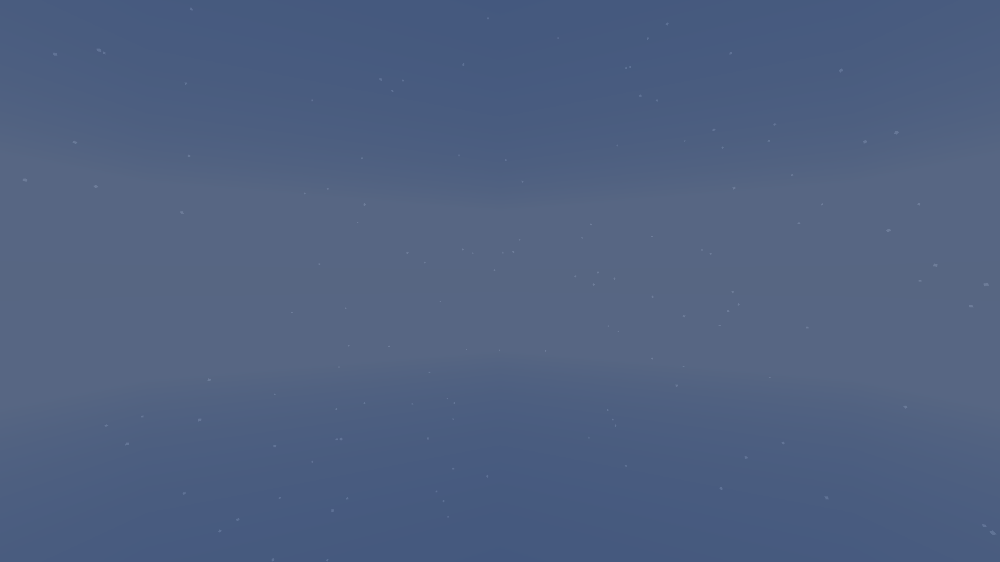
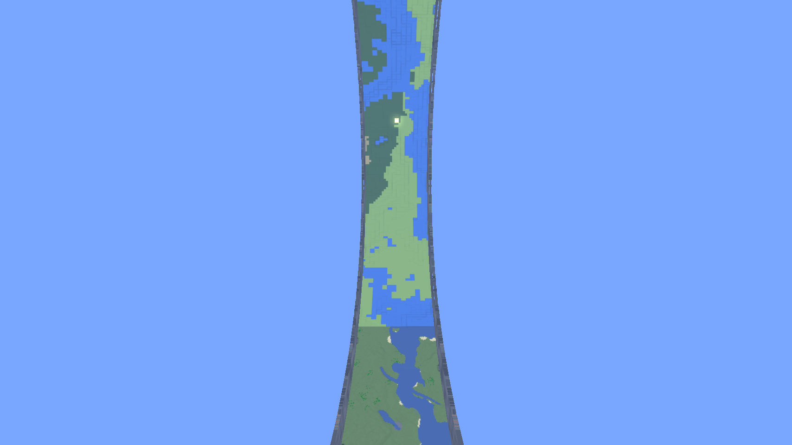

# Overworld horizon removal — issue #259

Development change, 8 October 2026. This is not a published release or a full
release qualification. The owner accepted the running 26.3 Fabric appearance
on 8 October 2026 and marked this change ready for integration (PR #261).

## Cause and change

RingWorld already suppresses vanilla's sunrise/sunset fan and black bottom
disc. Its previous matching lower-disc draw still depended on flat sky
geometry. Atmospheric fog also converged to sky colour only across the last
sixteen blocks below the rim, exposing a horizontal band at lower heights.

Both sky adapters explicitly skip vanilla's upper disc, dark bottom disc and
sunrise/sunset draw in the RingWorld Overworld; the added lower-disc draw is
removed. The explicit draw cancellation also removes a broad 26.3 band that
persisted in the initial fog-only candidate. The framebuffer already clears to
fog colour; both fog adapters now match that colour to the live `SKY_COLOR`
at every height. This provides a continuous background without disc boundaries.
The old height-blend helper and its obsolete test are removed. Sun, stars,
clouds and Atlas rendering remain active. Night and Void retain their existing
colours. Fog distances, weather visibility and world lighting are unchanged.
Camera fluid fog bypasses the adjustment; Atmosphere preserves vanilla
blindness/darkness fog colours. Nether and End bypass the changes through the
existing dimension-owned `ClientRingState.geometry()` guard.

The matched 26.1.2 Fabric sunset capture measures a background row-median RGB
range of **18, 13, 5** before the change and **0, 0, 0** afterward. Stars remain
visible. Matching the background colour removes the disc boundaries, rather
than moving the horizon outside one selected view.

Before (horizontal band at the centre):



After (same pose and clock):


26.3 fog-only intermediate candidate (remaining band):


26.3 final candidate, same pose and clock:


## Targeted development checks

The loader-neutral `RingHorizonCaptureClient` creates a disposable 2,048×128
world, seed 259, with atlas pregeneration disabled. It uses Spectator mode and
freezes the daylight clock. Six conditions are captured at camera Y=80 and
Y=160: sunset (12800), sunrise (23200), day (6000), night (18000), rain (6000),
and thunder (12800). The camera faces outward from Z=96.5, beyond the finite
wall, so terrain cannot hide the sky boundary. These are deck-height and
above-rim **unobstructed sky** comparisons, not ordinary walking screenshots.

Clear stages settle for 100 client ticks and weather stages for 220. The fixture
then captures resource reload, a Nether control, an outer-End-island control,
and Overworld return. It fails on timeout, resource-reload failure, or ring
geometry active in the other dimensions. Clouds and the vignette are disabled to isolate the sky background for pixel
checks. Master volume stays zero. Its
`CAPTURE COMPLETE` message confirms execution, not pixel correctness.

Run from an isolated checkout whose `run/config/ringworld.properties` and
`neoforge/run-client/config/ringworld.properties` select circumference 2048,
width 128, wall height 160, test mode false and pregeneration false. Keep
accessibility onboarding disabled and master volume zero in both options files.
Do not run this against a personal save directory.

```sh
JAVA_HOME=/path/to/jdk25 \
JAVA_TOOL_OPTIONS='-Dringworld.captureHorizon=true -Dringworld.backgroundTestWindow=true' \
./gradlew :runClient --max-workers=1 --console=plain
```

Use `:neoforge:runClient` for NeoForge. Supply the normal version-matrix Gradle
properties for 26.2 and 26.3. `-Dringworld.horizonCaptureShort=true` limits the
phase comparisons to sunset; reload and dimension controls still run.
`-Dringworld.horizonBlindnessControl=true` adds a blindness effect for a
special-fog control run. `-Dringworld.horizonSceneControl=true` instead selects
two inward/upward daylight poses at the same heights, inside the ring, to
check terrain, Atlas and the centered sun. Its six screenshots are reviewed
visually rather than using the uniform-background check. Screenshots use the `horizon-` prefix in the selected client's run directory.
Inspect all sixteen PNGs and retain logs before reusing a directory.

The sunset baseline and six-cell candidate evidence are retained locally under
ignored `logs/horizon-259/`. Pixel review compares the median RGB along rows in
the central half of each unobstructed sky capture; small stars do not affect
that median. An uninterrupted background should have no row colour range.
Dimension-control captures are inspected separately.

## Results

The final production change passes these targeted development checks:

| Minecraft line | Loader | Unit cases | Build | 16-capture run | Background pixel checks |
| --- | --- | ---: | --- | --- | --- |
| 26.1.x (tested 26.1.2) | Fabric | 447 | PASS | PASS | 14/14 PASS |
| 26.1.x (tested 26.1.2) | NeoForge | 447 | PASS | PASS | 14/14 PASS |
| 26.2 | Fabric | 447 | PASS | PASS | 14/14 PASS |
| 26.2 | NeoForge | 447 | PASS | PASS | 14/14 PASS |
| 26.3 | Fabric | 450 | PASS | PASS | 14/14 PASS |
| 26.3 | NeoForge | 450 | PASS | PASS | 14/14 PASS |

Every checked Overworld background has zero row-median RGB range; night
captures retain stars. Nether/End controls keep ring geometry inactive; all six final End control
images are pixel-identical to their earlier candidate controls. The Nether
controls retain their red fog backdrop; chunk geometry differs with load timing. All clients reload resources, return to the Overworld,
then save and stop normally. There are no failed or skipped unit cases.
The earlier fog-only six-cell run completed execution but failed 26.3 pixel
review; it does **not** qualify the final change.

Additional 26.3 inward/upward daylight controls pass on both loaders: live
terrain, the progressive Atlas, walls and the centered sun remain visible.
These worlds deliberately disable pregeneration; this is not a fully generated
Atlas quality comparison. The NeoForge ground pose exposes a gap in the
partially generated Atlas/handoff region. A repeat with unchanged `a46965c`
production renderers shows the same gap with the old dark sky band; #259
removes that band but does not qualify or fix Atlas coverage. Both captures
are retained in `scene-neoforge-26.3` and `scene-baseline-neoforge-26.3`.
After adding the opt-in scene poses, all six source
build/test cells were checked again; normal capture behaviour is unchanged.



Pinned test dependencies: Fabric Loader 0.19.3 / API 0.155.2+26.1.2 /
NeoForge 26.1.2.87 for the oldest line; Loader 0.19.3 / API 0.158.0+26.2 /
NeoForge 26.2.0.69 for 26.2; Loader 0.19.5 / API 0.160.5+26.3 /
NeoForge 26.3.0.7-beta for 26.3. The shared oldest adapter covers the
26.1–26.1.2 JAR family; individual 26.1 and 26.1.1 launches were not repeated.

Final logs and screenshots live in `logs/horizon-259/verified-*`, with
`verified-tests-*.json` and `verified-pixel-review.json`. The two preliminary
26.3 blindness controls showed a black background; neither is a full status-
effect, fluid or gameplay qualification. Owner visual acceptance is complete
for 26.3 Fabric. These checks do not qualify multiplayer, packaged release JARs,
performance, third-party shaders/resource packs, or the shelved pink-End-sky
report (#258).
