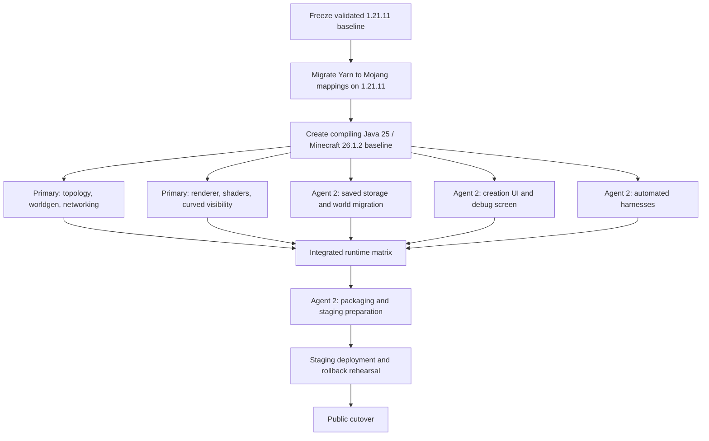

# Minecraft 26.1 port plan

Status: common/client source port and dedicated-server storage gate pass;
client/runtime port in progress

Target: Minecraft Java 26.1.2

Baseline: the validated Minecraft 1.21.11 implementation tagged
`mc-1.21.11-final` at commit `2c98650`

Baseline evidence:
[`MINECRAFT_1_21_11_FINAL_BASELINE.md`](MINECRAFT_1_21_11_FINAL_BASELINE.md)

This document is the authoritative implementation and coordination plan for
porting RingWorld from Minecraft Java 1.21.11 to the 26.1 release family. It
does not authorize changing RingWorld's topology invariants merely to make the
new game version compile.

The port is developed by two coding agents on separate dedicated PCs and
separate Git clones. Private GitHub issue
[#4](https://github.com/Delaser/RingWorld/issues/4) is the epic and escalation
channel; bounded P1–P4 and S2–S6 work uses linked issues
[#5–#13](https://github.com/Delaser/RingWorld/issues) under the protocol in
[`AGENT_COLLABORATION.md`](AGENT_COLLABORATION.md). The primary agent owns and
maintains issue status, dependencies, assignments, and integration order. The local
[`scripts/agent-comms.sh`](../scripts/agent-comms.sh) mailbox is only for a
future same-clone worktree arrangement.

## Why this is a porting project

Minecraft 26.1 is not an ordinary dependency update:

- the game requires Java 25;
- the game is no longer obfuscated;
- Fabric no longer provides Yarn mappings for 26.1;
- Loom uses a different non-remapping plugin;
- Fabric API names changed to Mojang terminology;
- world and dimension storage paths changed;
- chunk geometry GPU storage and rendering internals changed.

RingWorld directly modifies mappings, persistent world data, chunk ownership,
world generation, rendering, shaders, sky rendering, networking, and client
chunk presentation. Every one of those layers needs an explicit audit.

Primary references:

- <https://docs.fabricmc.net/26.1/develop/porting/>
- <https://www.fabricmc.net/2026/03/14/261.html>
- <https://www.minecraft.net/en-us/article/minecraft-java-edition-26-1>
- <https://github.com/FabricMC/fabric-example-mod/tree/26.1.2>

## Initial toolchain target

Recheck these values against the official Fabric 26.1.2 example immediately
before implementation:

```properties
minecraft_version=26.1.2
loader_version=0.19.3
loom_version=1.17-SNAPSHOT
fabric_api_version=0.155.2+26.1.2
```

The Gradle JVM, Java compiler release, development clients, dedicated server,
and packaged launchers all move from Java 21 to Java 25. The initial
`fabric.mod.json` constraint should require exact Minecraft 26.1.2 until
additional 26.1 patch versions pass the complete mixin and runtime suite.

## Non-negotiable invariants

The invariants in [`../AGENTS.md`](../AGENTS.md) remain authoritative:

- the server stores one canonical circumference;
- client presentation charts are transient;
- seam travel is a local step, not a corrective teleport;
- relationships use nearest periodic images;
- real chunks remain authoritative;
- gravity remains vanilla `-Y`;
- only the Overworld is periodic and curved;
- normal chunk render distance remains intentional;
- saved dimensions remain immutable.

No port task may lower a required mixin injection count, disable a subsystem,
or widen a tolerance simply to reach a green launch.

## Branch and worktree model

After the current documentation PR is resolved:

1. update local `main`;
2. run and record the complete 1.21.11 baseline;
3. tag that state `mc-1.21.11-final`;
4. create the integration branch `codex/minecraft-26.1-port`;
5. publish the exact integration commit and assign it through the task's
   individual GitHub issue.

Suggested secondary-agent branches:

```text
agent2/26.1-audit
agent2/26.1-storage
agent2/26.1-ui
agent2/26.1-harness
agent2/26.1-packaging
```

Each delegated task uses a fresh branch from a named integration commit. The
secondary agent creates that branch in its own clone, must not work in the
primary agent's checkout, and must not force-push a branch after handoff.

## Work graph



## Phase 0: freeze the 1.21.11 baseline

Owner: primary agent

Status: complete on 2026-07-28

Before changing mappings or dependencies:

- merge or close outstanding documentation branches;
- run `./gradlew test build`;
- run the safe-small local visual/gameplay harness;
- run the same-process layout-switch test;
- run the complete two-client multiplayer harness;
- run the production tangent and radial-up projection capture;
- record logs, screenshots, frame pacing, artifact hashes, and test results;
- archive the active server jar, client packages, checksums, configuration,
  world, Meridian datapack, and deployment documentation;
- tag the exact result `mc-1.21.11-final`.

Exit gate:

- the working tree is clean;
- all expected tests pass;
- the artifact and rollback state are reproducible.

## Phase 1: migrate mappings while staying on 1.21.11

Owner: primary agent

Status: complete on 2026-07-28

Fabric recommends migrating Yarn projects to Mojang mappings before moving to
26.1. Keeping Minecraft at 1.21.11 isolates naming errors from game behavior
changes.

Tasks:

- switch the 1.21.11 build from Yarn to Mojang official mappings;
- use Loom migration tooling only as a first pass;
- manually review every changed Minecraft name;
- port all 24 common/server and 11 client mixins;
- update exact targets and descriptors;
- keep `defaultRequire: 1`;
- update the mixin ownership map;
- restore all pure tests;
- rerun local and multiplayer runtime tests.

Exit gate:

- behavior is unchanged from the frozen Yarn build;
- no Yarn or intermediary identifiers remain in active source or descriptors;
- every required mixin applies.

Completion evidence:

- `./gradlew clean test build` passed all 73 cases;
- the safe-small local harness passed terrain, two natural seam crossings,
  block/entity/projectile/vehicle/AI/fluid/explosion/collision, rim, void, and
  frame-pacing probes;
- both crossings retained yaw/pitch and emitted zero correction packets;
- `runLayoutSwitchClient` reported `result=true`;
- the dedicated two-client harness reported
  `full scenario result=true`;
- the complete 15,552×4,096 atlas produced both tangent and radial-up
  projection captures with far-depth compression active;
- `method_31420` is retained only for Mojang's unnamed synthetic
  `ServerLevel` entity-tick lambda and carries an explicit `@Dynamic`
  explanation.

## Phase 2: establish the 26.1.2 toolchain

Owner: primary agent

Status: complete on 2026-07-28; see
[`MINECRAFT_26_1_COMPILER_BASELINE.md`](MINECRAFT_26_1_COMPILER_BASELINE.md)

Build changes:

- switch `net.fabricmc.fabric-loom-remap` to
  `net.fabricmc.fabric-loom`;
- remove the mappings dependency;
- replace `modImplementation`, `modCompileOnly`, and `modApi` with ordinary
  Gradle dependency configurations;
- replace remapped-artifact assumptions with `jar`;
- use Java 25 for Gradle and compilation;
- update Minecraft, Loader, Loom, and Fabric API;
- update `fabric.mod.json`;
- bump the mod to `0.2.0+mc26.1.2`;
- update development launch tasks without changing their behavioral purpose.

The output of this phase is a compiler-error inventory and a stable commit from
which parallel code work begins. It does not need to launch yet.

The captured common-source baseline contains 95 errors. Client compilation and
tests remain gated behind those common errors; no mixin requirement was
lowered.

## Primary-agent lane

The primary agent owns cross-cutting architectural code.

### P1: canonical topology and simulation ([#5](https://github.com/Delaser/RingWorld/issues/5))

Primary ownership:

```text
src/main/java/dev/ringworld/mixin/
src/main/java/dev/ringworld/net/
RingChunkCoordinates and other topology helpers
RingGeometry when required by port semantics
server/client positional packet mapping
```

Tasks:

- canonical chunk holder, ticket, watch, and simulation propagation;
- entity indexing, queries, tracking, save/load, and tick eligibility;
- natural player and vehicle folding;
- shortest-periodic reach, raycasts, AI, projectiles, explosions, sounds,
  particles, and effects;
- scheduled block and fluid ticks;
- explicit Overworld guards;
- clean incompatible-client rejection.

Exit gate:

- no persistent chunk or entity owns X outside `[0, C)`;
- seam travel produces no corrective teleport or camera discontinuity.

### P2: world generation ([#6](https://github.com/Delaser/RingWorld/issues/6))

Tasks:

- port coordinate-consuming density tagging;
- retain vanilla sampler, cache, interpolation, and aquifer identity;
- restore canonical neighbour aliases and seam-crossing writes;
- restore exterior suppression, rims, and void;
- restore finite-width spawn selection;
- extend multi-seed seam fixtures where 26.1 internals changed.

### P3: network protocol ([#7](https://github.com/Delaser/RingWorld/issues/7))

Tasks:

- port Fabric payload registration and codec APIs;
- retain `settings_v2` only if its byte layout remains identical;
- create `settings_v3` if fields, ordering, or encoding change;
- synchronize the protocol identity test;
- ensure a stale client fails before decoding ring-specific play payloads.

### P4: renderer and shaders ([#8](https://github.com/Delaser/RingWorld/issues/8))

Primary ownership:

```text
src/client/java/dev/ringworld/client/render/
GlobalSettingsMixin
SkyRenderingMixin
EntityRenderManagerMixin
ChunkBuilderBuiltChunkMixin
ChunkRenderingDataPreparerMixin
src/client/resources/assets/
```

Bring-up order:

1. launch with vanilla rendering;
2. restore real-chunk curvature;
3. restore curved frustum and section visibility;
4. restore entity tangent frames;
5. restore fixed sun and curved clouds;
6. restore the complete-ring atlas mesh;
7. restore live/proxy cross-fade;
8. restore proxy-only far-depth compression;
9. restore automated projection captures.

Prefer a RingWorld-owned uniform buffer over extending vanilla Globals if the
26.1 renderer permits it. Use Blaze3D abstractions rather than raw OpenGL so
the code does not deepen the future Vulkan migration cost.

## Secondary-agent lane

The secondary agent owns bounded tasks that can be integrated independently.

### S1: source and port audit

Start: immediately

Branch: `agent2/26.1-audit`

Status: complete and integrated on 2026-07-28; see
[`PORTING_26_1_AUDIT.md`](PORTING_26_1_AUDIT.md)

Create `docs/PORTING_26_1_AUDIT.md` containing:

- all dependency and toolchain changes;
- all 35 mixins with old target, candidate 26.1 target, confidence, risk, and
  validation test;
- Fabric API imports and expected renames;
- shader and render-pipeline ABI changes;
- manual world-storage paths;
- removed or renamed APIs;
- unresolved questions.

Restrictions:

- no production-code changes;
- use official Mojang and Fabric sources;
- do not mark an injection resolved without inspecting 26.1 source.

### S2: world storage and saved-world migration ([#9](https://github.com/Delaser/RingWorld/issues/9))

Start: after the Phase 2 baseline

Branch: `agent2/26.1-storage`

Status: complete and integrated on 2026-07-28. The Java 25 build passes all 83
cases. Isolated fresh and copied-1.21.11 server launches reached `Done`; legacy
settings were preserved byte-for-byte and an invalid legacy atlas was safely
rebuilt at the new dimension-owned path.

Secondary ownership:

```text
RingWorldSettings.java
RingTerrainAtlasServer.java
RingTerrainAtlas.java
ClientRingState.java
storage-specific tests
storage sections of ARCHITECTURE.md and OPERATIONS.md
```

Tasks:

- replace root-level Overworld paths with dimension storage APIs;
- namespace settings and atlas data appropriately;
- detect an upgraded 1.21.11 RingWorld;
- migrate an old atlas once or invalidate it safely;
- preserve immutable geometry;
- update ordinary-world rejection for the new region path;
- test fresh, migrated, missing, corrupt, interrupted-write, and
  different-world-hash cases.

Restrictions:

- no geometry field changes;
- no format bump without a serialized-layout change;
- no topology mixin changes;
- use world copies only.

### S3: creation UI and debug screen ([#10](https://github.com/Delaser/RingWorld/issues/10))

Start: after common source compilation is stable

Branch: `agent2/26.1-ui`

Secondary ownership:

```text
RingWorldCreationScreen.java
CreateWorldScreenMixin.java
CreateWorldScreenInvoker.java
PlayerPositionDebugHudEntryMixin.java
UI-specific tests and documentation
```

Tasks:

- port the creation-screen lifecycle;
- preserve the one-background/blur invariant;
- restore presets, custom fields, cost preview, validation, and immutable
  confirmation;
- port canonical F3 coordinates and atlas state;
- test invalid, safe-small, production, and custom layouts.

### S4: automated harnesses ([#11](https://github.com/Delaser/RingWorld/issues/11))

Start: after a 26.1 client can join a world

Branch: `agent2/26.1-harness`

Secondary ownership:

```text
LayoutSwitchTestClient.java
RingProjectionCaptureClient.java
MultiplayerTestClient.java
RingWorldMultiplayerTest.java
coordinated non-rendering changes in RingWorldClient.java
docs/TESTING.md
```

Tasks:

- port screenshot, quick-play, movement, and input APIs;
- retain resource-reload readiness guards;
- port multiplayer startup and reconnect;
- add a copied-world upgrade fixture;
- assert the new world-storage location;
- preserve tangent and radial-up captures;
- publish a 26.1 expected-results matrix.

Restrictions:

- do not change topology to make a test pass;
- do not weaken camera, packet, or seam tolerances without evidence;
- coordinate before editing `RingWorldClient.java`.

### S5: Java 25 packaging and deployment preparation ([#12](https://github.com/Delaser/RingWorld/issues/12))

Start: after the first successful client/server launch

Branch: `agent2/26.1-packaging`

Secondary ownership:

```text
deploy/client/
deploy/server/
deploy/web/
packaging sections of OPERATIONS.md
packaging-only build changes after coordination
```

Tasks:

- define a clean 26.1.2 Prism instance with Java 25;
- preserve account, save, option, and local configuration state during
  launcher updates;
- retain the 1.21.11 package as a separately labelled rollback;
- audit Meridian against data-pack version 101.1;
- prepare staging, publication, checksum, and rollback checklists;
- scan packages for credentials and runtime state.

Restrictions:

- do not publish packages;
- do not restart the public server;
- do not change website downloads;
- hand artifacts and validation results to the primary agent.

### S6: independent integration review ([#13](https://github.com/Delaser/RingWorld/issues/13))

After each major integration, the secondary agent performs a read-only audit:

- compare active mixins with `MIXIN_MAP.md`;
- search for Yarn and intermediary identifiers;
- search for 1.21.11 constants and dependencies;
- search for root-level Overworld paths;
- search for raw OpenGL;
- search for scattered modulo wrapping;
- confirm every global mixin has an Overworld guard;
- compare documentation with implementation.

Findings should be posted to the active task issue before code changes. Use
epic #4 only for cross-task dependencies, ownership conflicts, or an
inaccessible task issue.

## Agent handoff format

Every delegated task ends with:

```text
Task:
Base commit:
Branch:
Commit(s):
Files changed:
Tests run:
Tests passed:
Known failures:
Mixin targets changed:
Serialization/protocol changes:
Documentation updated:
Recommended integration order:
```

The secondary agent posts the handoff and commit hashes in the active task
issue for primary review and cherry-pick. The primary changes that issue to
`status:review`. The secondary must not rebase or force-push handed-off
commits, and must not begin the next issue until the primary changes it to
`status:ready` and posts an assignment.

## Integration order

Integrate secondary work in this order:

1. S1 audit;
2. S2 storage;
3. S3 creation UI;
4. S4 harnesses;
5. S5 packaging preparation;
6. S6 findings and follow-ups.

After every integration:

```sh
./gradlew test build
git diff --check
```

Storage, networking, topology, rendering, and packaging integrations also run
their corresponding runtime gates.

## Runtime gates

### Gate 1: fresh dedicated server

- Java 25 server launches;
- safe-small world is created;
- settings and atlas use the correct dimension path;
- atlas saves, resumes, and completes;
- no non-canonical chunks persist.

### Gate 2: copied 1.21.11 world upgrade

- Mojang's world upgrade completes;
- settings, geometry, players, inventory, entities, chunks, and rims survive;
- a seam-adjacent saved player reconnects correctly;
- the atlas migrates or rebuilds safely;
- the original copy remains untouched.

### Gate 3: visual client

- ordinary movement is smooth;
- block-boundary jitter and seam camera pop are absent;
- chunks, entities, culling, rims, clouds, sun, and lightmap align;
- the live/proxy transition remains continuous;
- the full ring is visible tangent and upward.

### Gate 4: multiplayer

- both clients acknowledge the same layout;
- players remain visible and interactive through the seam;
- combat, block update, vehicle, projectile, fluid, explosion, teleport, and
  reconnect pass;
- natural movement remains a local packet step.

### Gate 5: production geometry

- 15,552 × 4,096 validation passes;
- synthetic full-ring projection passes;
- a real atlas resource benchmark completes;
- GPU resources remain within policy;
- frame pacing is stable at ordinary render distance.

### Gate 6: staging deployment

- clean Windows and macOS packages launch on Java 25;
- fresh install and in-place update both pass;
- staging server and matching clients pass seam tests;
- Meridian remains functional;
- HTTPS checksums verify;
- rollback is rehearsed.

## Public cutover

Only after all gates pass:

1. stop and back up the public server;
2. retain the complete 1.21.11 service, world, jar, config, packages, and page;
3. upgrade a copied production world;
4. install the 26.1.2 server and Fabric API;
5. restore and verify Meridian;
6. inspect startup and migration logs;
7. join with two packaged clients;
8. rerun seam, combat, block, atlas, and reconnect checks;
9. publish clearly versioned packages;
10. retain immediate rollback.

## Definition of done

The port is complete only when 26.1.2 provides the same or better RingWorld
experience as the frozen 1.21.11 baseline:

- one canonical server plane;
- smooth natural wrapping;
- cross-seam multiplayer interaction;
- continuous world generation;
- safe upgraded-world storage;
- complete curved rendering;
- full-ring visibility at normal render distance;
- Java 25 Windows and macOS packages;
- functional Meridian integration;
- rehearsed deployment rollback;
- synchronized code and documentation.
