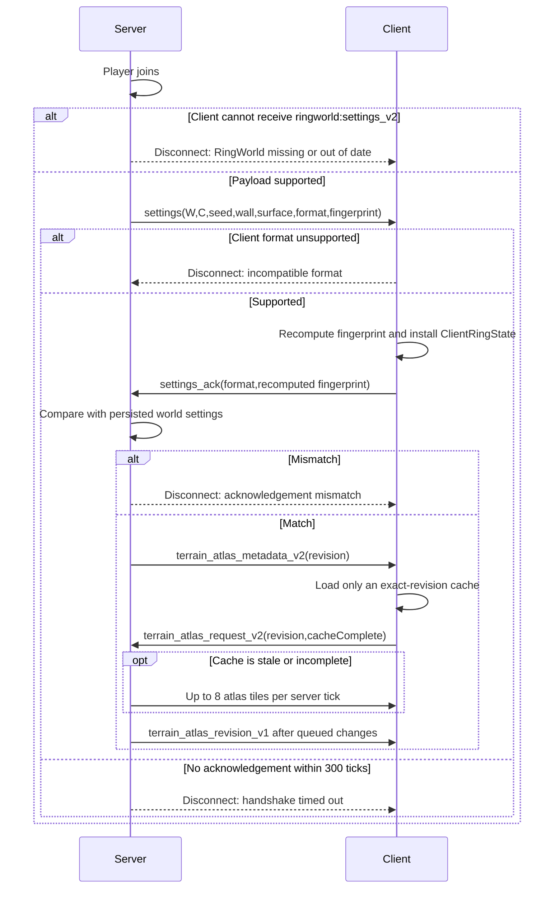

# Network protocol and client charts

RingWorld is required on the dedicated server and every client. The protocol
has two jobs:

1. install identical immutable geometry before ring-specific rendering;
2. transport the generated surface atlas used by the distant-ring renderer.

Normal Minecraft packets are then projected between canonical server
coordinates and each client's nearby presentation chart by mixins.

## Registered custom payloads

All identifiers use the `ringworld` namespace.

| Direction | Identifier | Fields | Purpose |
| --- | --- | --- | --- |
| S2C | `ringworld:settings_v2` | width, circumference, seed, wallHeight, surfaceReferenceY, formatVersion, layoutFingerprint | Install the complete immutable world layout |
| C2S | `ringworld:settings_ack_v2` | formatVersion, independently recomputed layoutFingerprint | Prove the client installed and verified the same layout |
| S2C | `ringworld:terrain_atlas_metadata_v2` | worldHash, sampleStep, columns, rows, tileSize, presentCells, complete, revision | Describe server atlas/cache identity and durable surface generation |
| C2S | `ringworld:terrain_atlas_request_v2` | worldHash, revision, cacheComplete | Request a full snapshot or subscribe an exact complete cache |
| S2C | `ringworld:terrain_atlas_tile_v2` | worldHash, tileX, tileZ, byte array | Transfer one height/colour tile |
| S2C | `ringworld:terrain_atlas_revision_v1` | worldHash, revision | Commit all earlier ordered tile changes as one durable revision |
| C2S | `ringworld:atlas_pregen_status_request_v1` | worldHash | Observe the authoritative Generate Entire Ring status |
| C2S | `ringworld:atlas_pregen_control_v1` | worldHash, stable action value | Request start, pause, resume, or cancel; server rechecks authority |
| S2C | `ringworld:atlas_pregen_status_v1` | atlas identity, geometry, durable chunks, complete progress, canControl, message | Authoritative player-map status/progress |
| C2S | `ringworld:multiplayer_test` | role, phase, passed, value | Opt-in automated test reporting only |

Payload registration occurs in `RingWorldNetworking.registerPayloads` during
common initialization.

The layout fingerprint covers the seed, width, circumference, saved wall
height, surface reference, settings format, rim thickness, and rim style
version. The client recomputes it from the decoded fields instead of merely
echoing the server-provided value. The same layout fields feed worldgen, shader
globals, terrain-atlas identity, and cache invalidation. The common
`RingSettingsHandshake` helper owns payload construction, independent
fingerprint derivation, acknowledgement construction, and server comparison so
the two endpoints cannot silently diverge on a layout class that is not the
safe-small fixture.

## Login sequence



Current geometry protocol compatibility is `RingWorldSettings.FORMAT_VERSION`
(currently 2). Format 1 saved settings migrate explicitly to format 2 with the
vanilla Overworld surface reference Y=64; format 1 network peers are not
accepted. There is no feature-bit negotiation: compatibility requires the
exact settings format and the complete current settings, revisioned-atlas, and
map-control channel generations. Those behaviors are a single engine contract,
not independently optional features. A semantic change to coordinate meaning
or required packet behavior must increment the format, update both ends, and
add mismatch tests.

Payload channel identifiers also name their byte-layout generation. The
complete-layout protocol uses `settings_v2`/`settings_ack_v2`. A breaking codec
change must use a new identifier instead of reusing the old channel: an old
codec otherwise consumes its known prefix and Netty disconnects on unread
trailing bytes before RingWorld can show a useful mismatch message. With a new
identifier, `ServerPlayNetworking.canSend` fails cleanly and the server directs
the player to the current package.

The server rejects a client that cannot receive the settings payload, complete
revisioned-atlas suite, or map status payload before starting the handshake.
The client likewise requires acknowledgement, atlas request, map-status
request, and map-control channels before installing session state. This
prevents an older build with the same geometry format from joining without
current atlas semantics. A loader-neutral tracker gives every join a 300-tick
deadline, treats duplicate acknowledgement as idempotent, rejects unexpected
or mismatched acknowledgement, gates all RingWorld requests until success,
and clears state on disconnect.

Atlas-pregeneration status is independent from settings and atlas tile codecs:
its `_v1` identifiers must advance on any layout change. Status observers are
cleared on disconnect/world unload, receive periodic snapshots no more than
once per 20 ticks plus immediate transitions, and cannot mutate atlas state
from the network thread. Control actions and lifecycle states use explicit
stable numeric wire values rather than enum ordinals.

## Atlas wire format

The source atlas samples the complete canonical surface every eight blocks by
default. One tile contains up to 16×16 cells. Each cell encodes:

```text
present: boolean
height: signed short
surface RGB: int (low 24 bits)
```

The height is the exposed top face at one coordinate above the highest surface
block. RGB is sampled from that highest block, applies representative texture
luminance to biome water, grass, and foliage tint, and uses block map colour
otherwise. These semantics are stored as terrain-atlas disk format 4; the
format-5 disk semantics add a dedicated-server map-colour fallback for
zero/unloaded grass and foliage tint. Format 6 adds the persisted monotonic
surface revision; it changes atlas identity and rebuilds older caches.

The first two tile bytes are its actual width and height. Tile decoding checks:

- tile coordinates are in metadata bounds;
- dimensions equal the expected edge-clipped size;
- payload length is bounded;
- no bytes trail the expected data.

Cells received as absent do not erase present client-cache cells. This allows a
client with a previously complete cache to reconnect while a restored server
atlas is temporarily less complete. Applying an identical present tile is
idempotent: it does not advance the client revision, save the cache, or rebuild
the full GPU ring. Only the actual incomplete-to-complete transition bypasses
the ordinary publish/save coalescing intervals. A revision commit is the
durable transaction marker and forces a cache save, but changed tiles are the
only events that request a visual publication. Complete-atlas tile bursts wait
for three quiet seconds, bounded to ten seconds, and therefore do not upload an
identical full texture again for the later commit packet.

The server:

- streams at most 8 tiles per player per tick;
- queues dirty tiles for every connected atlas subscriber every 20 ticks;
- persists dirty atlas state every 200 ticks;
- retains complete subscriptions for later terrain edits;
- commits a new revision only after all preceding changed tiles are queued on
  that player's ordered connection.

Clients never advance the durable atlas revision per tile. This avoids
mistaking a disconnected half-batch for a valid complete cache. Exact revision
and completeness permit reconnect reuse; any mismatch starts from a fresh
client atlas and receives the authoritative full tile snapshot.

## Canonical and presentation packet mapping

The authoritative server speaks canonical X. The client maps values into the
periodic image nearest its local player.

### Server-to-client mappings

`ClientPlayNetworkHandlerMixin` handles:

| Packet class/path | Presentation conversion |
| --- | --- |
| Chunk data | Canonical chunk X → nearest image chunk |
| Light update | Same image as its chunk |
| Biome-only chunk data | Rebuild serialized positions with image chunk X |
| Chunk unload | Unload the corresponding image chunk |
| Render-distance centre | Project centre; re-key whole chart if disjoint |
| Entity spawn | Canonical entity X → nearest image |
| Entity position sync/teleport | Project absolute X; leave relative X changes alone |
| Vehicle correction | Project near current root vehicle |
| Block/chunk delta update | Canonical block X → nearest image block |
| Block entity/breaking/block/world event | Project event position |
| Particle, explosion, sound | Project effect X |
| Damage source, `/look` target | Project damage around the hurt entity and look targets around the player |
| Minecart interpolation batch | Project each absolute step into one continuous chart |
| Open sign editor | Project block position before resolving its block entity |

Player position/rotation packets are authoritative explicit teleports,
respawns, or portal-like moves. They are not used for natural seam folding.
The client maps the authoritative canonical X target to the equivalent
presentation image nearest its current camera, then ensures its chunk-array
chart is compatible with that image. This prevents a seam-adjacent explicit
teleport from clearing chunks which remain continuously watched by the server.

When a canonical fold changes an already-tracked entity's chunk section, the
server retains that pairing only for a pending destination chunk that remains
inside the recipient's periodic watch window. It does not send a replacement
entity or grant initial visibility before normal chunk readiness; the client
therefore continues to receive the same root-vehicle and passenger identities.

### Client-to-server mappings

`ClientConnectionMixin` canonicalizes outbound:

- block action positions;
- block interaction positions and hit vectors.
- sign updates, pick-block-with-data, and block-entity tag queries.

Player and vehicle movement packets remain continuous presentation-space
steps until `ServerPlayNetworkHandlerMixin` selects the nearest image and
lets vanilla validate them locally.

### Chunk chart re-keying

Small render-centre movement uses vanilla incremental load/unload behavior.
For a disjoint change:

1. determine the projected next centre;
2. compare it with the stored client chunk-map centre;
3. clear all old chunk slots if overlap is impossible;
4. set the new centre;
5. schedule terrain rebuild.

This is required because canonical unload packets arriving after a long
teleport would otherwise be projected into the new chart and fail to address
the old slots.

## Server proximity and tracking

Sending a canonical coordinate is insufficient if the server decides the
recipient is one circumference away. Periodic distance is also applied to:

- player chunk watch filters;
- entity tracker visibility;
- nearby effect delivery;
- tick eligibility;
- block/entity reach and attacks;
- projectile candidates;
- explosion exposure/knockback;
- entity query boxes.

When adding a new packet-backed gameplay feature, audit both:

1. whether the server selects/delivers it using periodic distance; and
2. whether the client projects its position into the active chart.

Fixing only one side produces features that work from one direction or are
simulated correctly but appear in the wrong place.

Maps, compasses, saved spawn pointers, and locator-bar waypoints require
dynamic nearest-image semantics rather than a one-time packet rewrite and are
not yet supported across the seam. GameTest/debug overlays and operator-only
structure, jigsaw, command-block, and test-block packets are outside the
gameplay contract. Third-party payloads are opaque; compatible mods must use
the public geometry API and own their coordinate conversion. The complete
26.1.2 audit is recorded in `PROTOCOL_HARDENING_2026-08-01.md`.

## Reconnect and cache behavior

Client geometry and presentation state are cleared on disconnect. The atlas is
saved first when dirty. Reconnect starts a new presentation chart from the
authoritative join position but may reuse the complete disk atlas by world
hash.

The chart index is deliberately never serialized. Server entities are folded
canonical before save and again before entity-manager indexing after load.

## Protocol extension checklist

For a new custom payload:

1. define a bounded codec;
2. register it in the correct play direction;
3. guard it by geometry/format/world hash as appropriate;
4. execute world mutations on the server thread;
5. reject stale or out-of-bounds identifiers;
6. add disconnect/cache/reconnect behavior;
7. document the identifier and fields here;
8. include it in the two-client integration harness if it affects topology.
