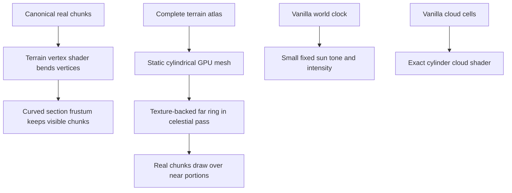

# Rendering

## Design goal

The renderer must show one closed ring while Minecraft loads only an ordinary
nearby chunk radius. Real chunks remain the source of truth near the player;
the rest of the ring is a lightweight visual LOD anchored to canonical world
coordinates.

The active rendering stack is:



## Sharing geometry with shaders

`GlobalSettingsMixin` extends Minecraft's shared Globals UBO with seven named
RingWorld vectors after the untouched vanilla fields:

```text
RingWorldLayout   = active, circumference, width, saved wall height
RingWorldVertical = surface reference Y, wall top Y, cloud base Y, physical centre Y
RingWorldRender   = min Z, max Z exclusive, half circumference, view distance
RingWorldHandoff  = live fade start/end, proxy fade start/end
RingWorldDetail   = detail start/end, near/far terrain reveal
RingWorldAtmosphere = near/far haze, haze exponent, cloud fade start
RingWorldAtmosphere2 = cloud fade end, visual profile version, reserved, reserved
```

The vanilla camera, screen, time, menu-blur, and RGSS values keep their normal
types and meanings. Terrain, cloud, and complete-ring shaders include the same
overridden `globals.glsl`, and the custom ring pipeline declares Globals too.
Values are rebuilt each frame from negotiated immutable settings, actual
Overworld bounds, and `RingRenderProfile`.

This remains a version-sensitive shader ABI extension. Any Minecraft shader or
`GlobalSettings` upgrade must audit the std140 field order, buffer size, and
all overridden programs.

## Real terrain curvature

`assets/minecraft/shaders/core/terrain.vsh` reconstructs:

- canonical vertex position from section-local position and `ChunkPosition`;
- exact camera world position from integer `CameraBlockPos` minus
  `CameraOffset`;
- camera-local cylindrical position using the shared formula in
  `RingGeometry`.

The subtraction sign on `CameraOffset` is critical. Adding it doubles
sub-block camera movement and creates a snap at every block boundary.

Geometry uses the curved chord position, while fog distance is the greater of
curved distance and original intrinsic surface distance, multiplied by 1.02.
This keeps the last real chunks atmospheric without raising a dense fog wall.

The matching `terrain.fsh` retains vanilla texture sampling, alpha cutout, and
fog, then adds the visible half of the live/LOD cross-fade.
`RingRenderProfile` publishes the exact transition endpoints consumed by both
sides. The complete-ring
surface is rendered earlier, behind terrain, so proxy alpha alone cannot show
through opaque chunks. In the current profile, from 78% to 102% of effective
view distance, a stable
screen-space threshold progressively discards live terrain fragments and
reveals the aligned proxy underneath. This preserves the opaque terrain
pipeline and depth behavior while avoiding temporal random noise. The effect is
strictly guarded by the RingWorld activation marker; Nether, End, menus, and
ordinary worlds retain the vanilla fragment result.

## Curved frustum

Vanilla CPU culling happens before the vertex shader and initially sees flat
chunk bounds. A flat parent octree box can be outside the camera even when its
curved children rise into an upward view.

`CurvedRingFrustum`:

- conservatively descends every octree branch;
- transforms each 16-block section AABB into an exact cylindrical envelope;
- performs ordinary frustum testing on that envelope.

This avoids upward-looking chunk pop without drawing every section. When
changing the terrain transform, update `RingGeometry.toCameraLocalBounds` and
the shader together.

### Section occlusion

Frustum culling is not the only CPU visibility decision. Vanilla also
propagates renderable sections through a six-direction graph and consults each
section's flat opaque-face visibility matrix. A mountain can stop that graph
even when the cylindrical transform later bends sections behind it into the
camera's view.

While a RingWorld Overworld is active,
`ChunkRenderingDataPreparerMixin` forces the graph onto vanilla's supported
non-occluding traversal path. The client still applies normal render distance,
the curved section frustum, mesh-layer culling, and GPU depth testing. Nether,
End, and non-RingWorld sessions retain vanilla smart occlusion.

## Finite-edge section meshing

Before a section reaches frustum testing, vanilla requires all eight
horizontal neighbour chunks to be full and lit. The outward neighbour of a
finite rim is deliberately nonexistent, which otherwise leaves genuine
cobblestone blocks collidable but permanently unmeshed.

`ChunkBuilderBuiltChunkMixin` treats a neighbour as ready only when its chunk Z
lies outside the configured finite band. Existing interior neighbours still
use vanilla's full-chunk and lighting test. The renderer region then receives
Minecraft's empty client chunk for the exterior side and emits the exposed rim
faces normally.

## Entity models

`EntityRenderManagerMixin` replaces the common entity translation:

1. recover the entity's intrinsic position from camera position plus vanilla
   render delta;
2. map that position through `RingGeometry.toCameraLocal`;
3. rotate the model about local Z by its tangent-frame angle.

The local player has zero tangent delta, so controls and camera orientation
remain vanilla. Distant entities stand perpendicular to their local section of
curved ground.

## Complete-ring texture

`RingSurfaceTextureRenderer` is the active distant surface implementation.

### Source data

The server atlas contains the exposed top-face height and RGB of the actual
highest generated surface block every eight blocks. `Chunk.sampleHeightmap`
already returns that block's Y coordinate; the sampled state uses that exact Y
and the mesh height is its top face at Y+1. Water, grass, and foliage start with
their biome tint, then apply an average block-texture luminance so the tint is
not mistaken for the finished lit pixel colour. Other blocks use their map
colour. Rendering waits for the client atlas to be complete. Atlas format 4
records the original highest-block tint semantics. Atlas format 5 additionally
falls back to the sampled block's map colour when a dedicated server's
client-owned grass/foliage colormap lookup returns zero. This invalidates the
black format-4 dedicated-server caches automatically while retaining true
biome tint on integrated servers where the colour maps are loaded.

### World lifecycle

The visual surface is world-owned even though `SkyRenderer` and its static GPU
resources can survive a return to the menus. On disconnect and again when a
new settings payload is accepted, `RingWorldClient` closes the buffered texture
and mesh before clearing/installing client state. `RingSurfaceTextureRenderer`
also refuses to draw unless the current session's atlas exists and is complete.

A newly generated world therefore shows real chunks and atmospheric effects
while its own atlas is built. It must never display the previous world's
complete-ring texture during that interval. Once the new world-hash atlas is
complete, the renderer builds a new texture and mesh normally.

### GPU texture

The client bilinearly samples the source atlas into the dimension-aware,
quality-bounded size:

```text
texture columns = min(circumference, 4096)
texture rows = min(width, 1024)
```

The 2048×416 development ring therefore gets a 2048×416 image from 256×52
source cells. Height gradients and local relief apply restrained terrain
shading before upload. The renderer also constructs an explicit box-filtered
mip chain with periodic X sampling and clamped Z sampling. The GPU sampler uses
repeat U, clamp V, linear magnification/minification, and mip filtering.

### Mesh

The mesh targets one segment or band per eight intrinsic blocks and applies
fixed quality caps:

```text
segments = min(ceil(circumference / 8), 512)
bands = min(ceil(width / 8), 128)
vertices = segments * bands * 6
```

Each vertex uses the sampled terrain height to vary its radius. Texture U is
canonical X/circumference; V is the finite width coordinate. The mesh exists
in one global ring-centred model.

Walking does not rebuild the mesh. Per frame, the renderer:

- translates the centre by camera radius and width offset;
- rotates the global ring by negative canonical camera angle;
- supplies actual view distance, circumference, camera X phase, and camera Z
  to the custom surface shader;
- binds Minecraft's current lightmap beside the canonical terrain texture;
- draws with culling and depth writes disabled.

It runs during celestial rendering. `RingRenderProfile` clamps every handoff
endpoint to the same physical half-circumference, including when a requested
view distance reaches the whole ring. The fragment shader derives shortest
periodic intrinsic surface distance from the global cylinder vertex angle.
Minecraft's normal level projection cannot contain the production cylinder:
at 28 chunks its far plane is about 1,792 blocks, while the 15,552-block
circumference has a roughly 4,950-block surface diameter and a centre-camera
distance of more than 5,300 blocks to the far width edge. This appears most
aggressively while looking tangentially along the ring; looking radially
straight up exercises a different projection extreme.

The complete-ring vertex shader therefore leaves clip-space X, Y, and W
untouched and clamps only positive-W Z values that would cross the far plane.
The apparent angular size and physical curvature remain exact, vertices behind
the eye retain normal frustum clipping, and the correction cannot cause more
real chunks to load. Because the proxy renders in the sky stage without depth
writes, later authoritative chunks, rim walls, entities, and local clouds
still cover it.

The atlas begins revealing beneath the last 24% of loaded distance. More than
half of its terrain signal remains at the nominal chunk edge, then rises
smoothly toward full strength by 1.25 times the view distance. Its opacity
follows an independent cross-fade: the proxy is fully absent within 68% of
view distance and is effectively opaque by 98%. This ensures the live-terrain
dither reveals terrain rather than translucent fog over sky, while still
keeping the proxy absent from the player's local interaction area.
The proxy remains absent locally, preventing a duplicate visual surface over
nearby rim walls or exterior void. The live terrain fog-distance boost is only
1.02 so its haze remains close to the terrain rather than forming a raised
curtain. Far-distance haze remains restrained. Reveal strength, haze endpoints
and exponent, and the curved-cloud fade are named values in versioned
`RingRenderProfile` policy rather than shader literals. Real chunks remain
authoritative geometry.

Visual profile 4 retains profile 3's terrain reveal of 0.52 toward 0.98 and
distance haze of 0.04–0.16, keeps proxy opacity at 68%–98% of effective view
distance, and adds complete-cylinder far-depth handling. Geometry-derived
matrix captures showed that the older
0.32 reveal/0.07–0.22 haze policy produced a conspicuous fog-colour belt, and
that the profile-2 72%–118% opacity span still composited too much sky through
the proxy at the nominal chunk edge.

### Lighting and colour matching

The atlas stores terrain albedo rather than a permanently lit screenshot. The
surface fragment shader samples Minecraft's live lightmap at the exact texel
for maximum sky light and zero block light, then multiplies the atlas colour by
that RGB value. The topmost heightmap surface represented by each atlas sample
is normally sky-exposed, making this the closest live-chunk lighting case
available without storing block geometry.

This keeps the proxy synchronized with the client's current day/night
exposure, visual sky tint, weather response, gamma, lightning flashes,
darkness, and night vision. It replaces the former grey scalar whose full-night
floor was 65%, which left the far ring bright and saturated while real terrain
became dark blue-green. Local torches and other block lights are intentionally
not represented: the static atlas has neither a dynamic emission layer nor
enough geometry to apply one faithfully.

### What the texture is not

It is not:

- a block mesh;
- a collision surface;
- a source of entities or structures;
- a transparent-layer capture;
- a replacement for live chunks.

Trees, foliage, water surfaces, buildings, and individual blocks reduce to
top-surface colour and height. Biome tint, live full-skylight exposure, relief
shading, periodic filtering, mipmaps, and the fog-colour reveal improve
recognition and motion stability, but the image cannot become geometrically
identical to live blocks from this two-field atlas alone.

## Clouds

The vanilla volumetric cloud cell data is retained, but
`rendertype_clouds.vsh`:

- reads the deck base from synchronized layout (`wallTopY + 8`);
- reconstructs canonical camera and cell phase;
- bends cell vertices using the same circumference, surface reference, and
  physical centre as terrain;
- consumes the shared profile's view- and circumference-bounded fade before
  the local cloud layer can wrap into a complete tube.

The eight-block cloud clearance is a named fixed design value validated before
world creation. Saved wall height therefore moves the wall and cloud deck
together. `RingRenderProfile` computes the cloud fade from effective view
distance and caps it to 12% of circumference, so short rings cannot turn an
ordinary local deck into a visible barrel.

Far-field cloud systems are only implied by atmospheric rendering; the atlas
does not encode weather volumes.

## Fixed sun and day/night

The ring surrounds one central star:

- vanilla moving sun rendering is suppressed;
- moon rendering is suppressed;
- star rotation is set to zero;
- the sun direction is computed from the camera to the physical ring centre;
- moving across the finite Z width tilts that direction correctly;
- the sun is redrawn after the ring surface so it appears in front;
- both `30.0` half-width constants in vanilla `renderSun` are replaced with
  `3.0` only for the RingWorld redraw, shrinking the original Minecraft sun
  from roughly nine degrees across to about 0.9 degrees.

The original Minecraft sun texture, celestial atlas, and pipeline remain in
use. `RingSkyCycle.sunVisual` maps the authoritative 24,000-tick world clock
to four smoothly interpolated keyframes:

| Time | Brightness | Tint |
| --- | ---: | --- |
| Dawn, 0 | 0.35 | warm orange |
| Noon, 6000 | 1.00 | nearly neutral |
| Dusk, 12000 | 0.35 | warm orange |
| Midnight, 18000 | 0.04 | cool blue |

The fragment colour passed to vanilla's sun draw receives that RGB tint and
alpha multiplier. A smoothstep curve connects each six-thousand-tick segment,
so there is no edge crossing or pop. Minecraft's existing sky colour,
lightmap, fog, weather brightness, stars, beds, spawning, crops, and daylight
sensors remain driven by the same world time; RingWorld does not introduce a
second gameplay clock.

There is no active shadow-panel mesh or render pipeline. The removed
twenty-panel implementation and its revert checklist remain frozen in
[`SUN_RENDERING_SNAPSHOT_2026-07-26.md`](SUN_RENDERING_SNAPSHOT_2026-07-26.md).
Illumination is intentionally global rather than position-dependent.

## Render order

The intended conceptual order is:

1. background sky and stars;
2. complete ring texture, covering stars behind the structure;
3. small fixed, time-toned central sun;
4. real terrain/chunks and entities as the final authoritative surface.

When diagnosing visual occlusion, inspect both call order and pipeline depth
settings. Moving the texture to a later pass can cause it to overwrite real
terrain.

## Removed predecessor code

The colour-only CPU Arch mesh and `RingVisibility` taper helpers have been
deleted. `SkyRenderingMixin` now owns only the fixed-sun interception and the
active `RingSurfaceTextureRenderer` invocation. This avoids two competing
sources of transition constants.

## Visual regression checklist

Capture and compare:

- ordinary walking and sprinting for sub-block jitter;
- X=0/C crossing in both directions;
- upward views at 28 chunks;
- both apparent live/LOD bases and the zenith;
- centre and both Z edges of the band;
- wall top and void beyond the wall;
- noon, warm dusk, cool midnight, and warm dawn;
- clear weather and rain;
- opaque terrain and water/translucent surfaces at the handoff;
- movement at the handoff with no mip shimmer or canonical-UV seam;
- nearby and distant entities standing on curved terrain;
- reconnect and explicit teleport after the client chart changes.
